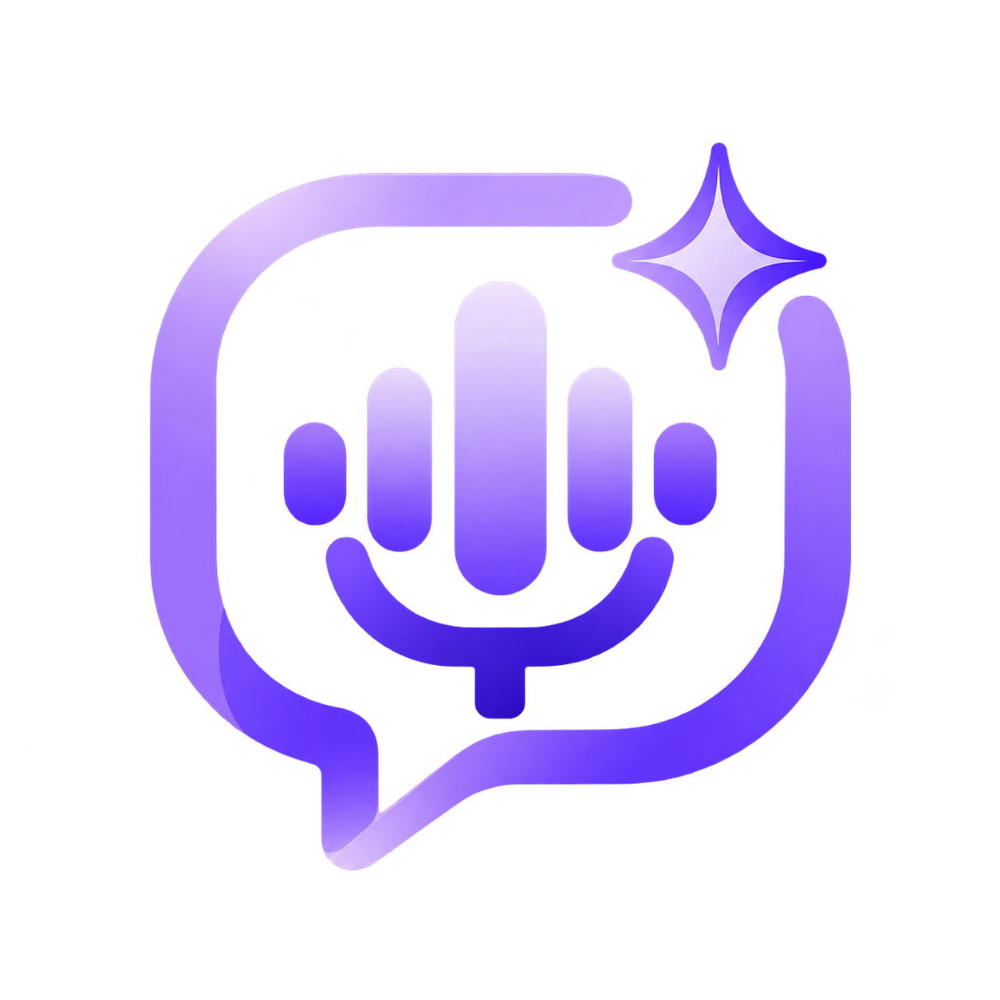
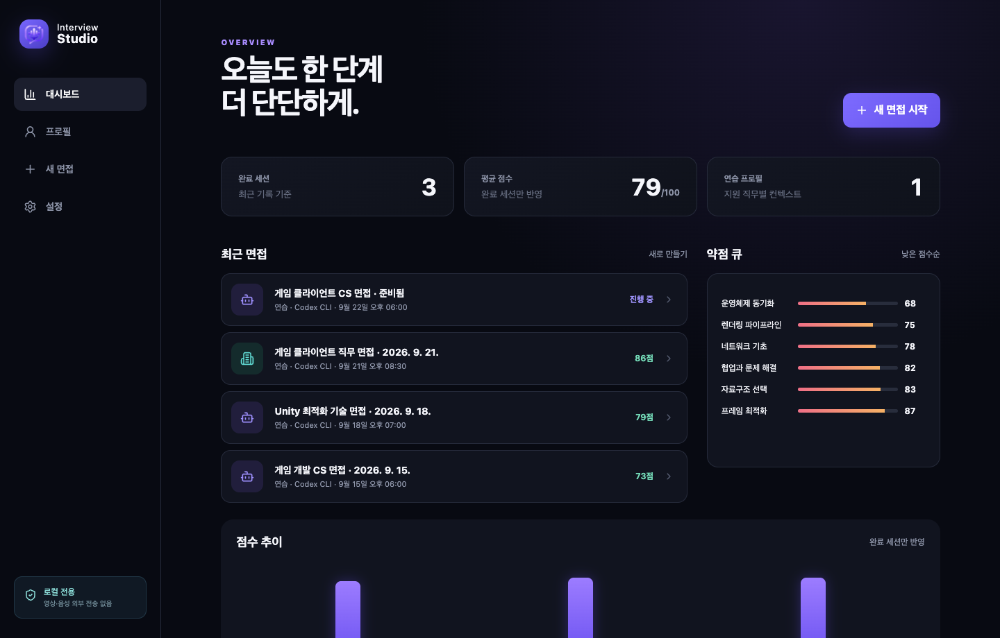
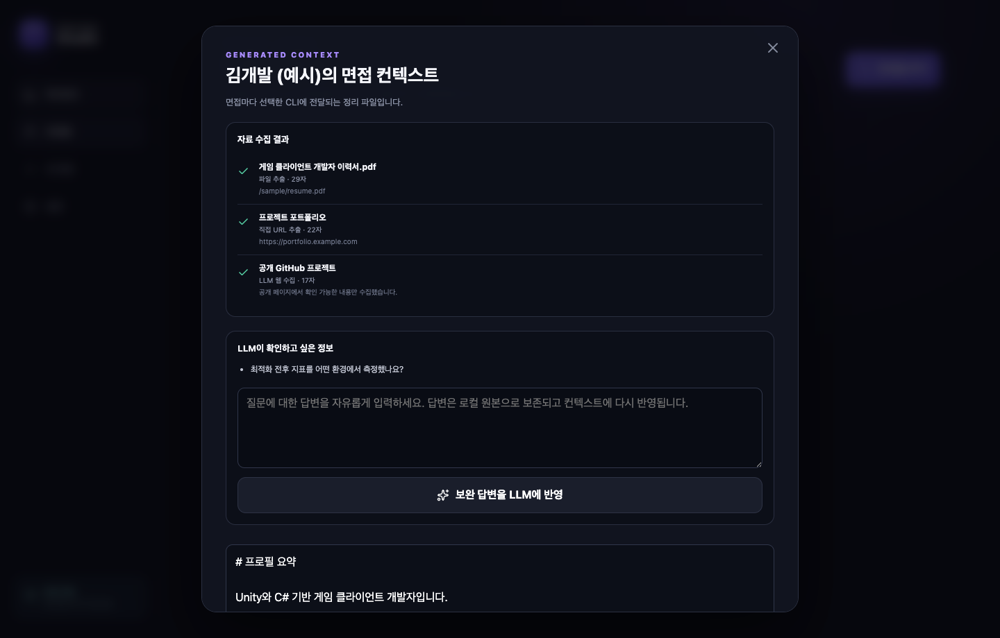
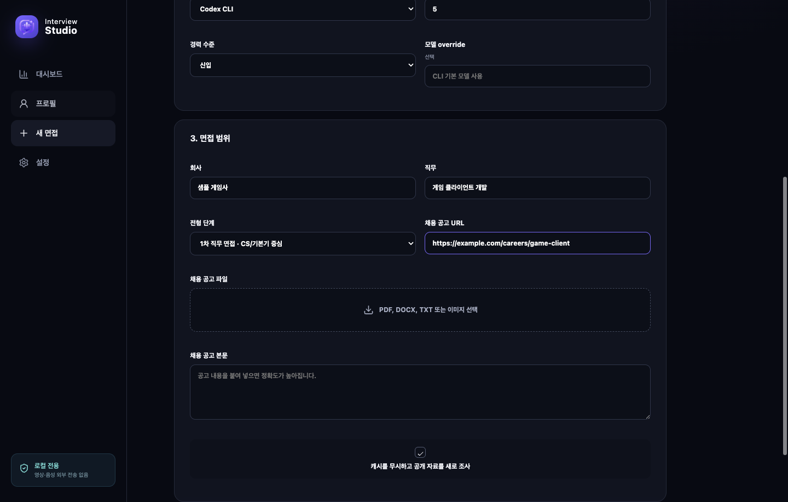
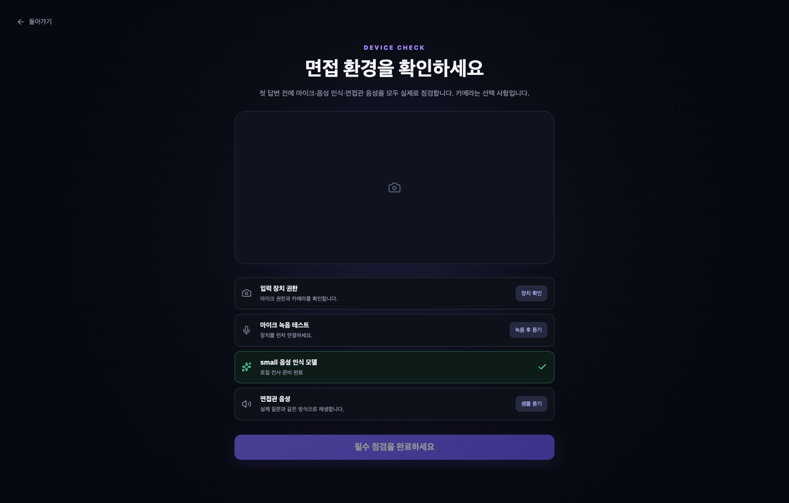
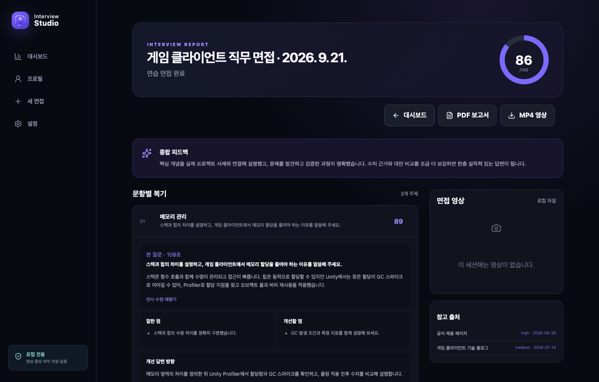

# Interview Studio



Interview Studio는 설치된 AI CLI와 로컬 음성·영상 도구를 이용해 한국어 기술 면접을 연습하는 데스크톱 앱입니다. 프로필과 공개 채용 자료를 바탕으로 질문을 만들고, 음성 질문부터 마이크 답변, 동적 꼬리 질문, 녹화, 전사, 최종 평가까지 하나의 세션으로 진행합니다.

> 현재 버전은 기능 검증을 위한 unsigned alpha입니다. 중요한 원본 자료는 별도로 백업하고, 앱의 평가를 실제 채용 결과나 전문적인 판단의 대체물로 사용하지 마십시오.

## 앱 화면

아래 화면은 실제 앱에 공개용 가상 프로필과 면접 기록을 넣어 캡처한 예시입니다. 실제 사용자 자료나 녹화는 포함되어 있지 않습니다.

<table>
  <tr>
    <td width="50%">
      <strong>대시보드</strong><br />
      <sub>최근 면접, 평균 점수, 약점 큐와 점수 추이를 한눈에 확인합니다.</sub><br /><br />
      
    </td>
    <td width="50%">
      <strong>프로필 컨텍스트</strong><br />
      <sub>파일·URL 수집 결과와 LLM이 정리한 면접 컨텍스트를 검토하고 보완합니다.</sub><br /><br />
      
    </td>
  </tr>
  <tr>
    <td width="50%">
      <strong>회사 면접 설정</strong><br />
      <sub>회사, 직무, 전형 단계와 채용 공고를 입력해 맞춤 면접을 준비합니다.</sub><br /><br />
      
    </td>
    <td width="50%">
      <strong>면접 전 장치 점검</strong><br />
      <sub>카메라, 마이크 시험 녹음, Whisper 모델과 면접관 음성을 확인합니다.</sub><br /><br />
      
    </td>
  </tr>
</table>

### 면접 결과와 복기

질문과 전사, 문항별 점수·피드백·개선 답변 방향, 참고 출처와 녹화 영상을 한 화면에서 확인합니다.



## 주요 기능

- 기술 면접과 회사 맞춤 면접
- 연습 모드와 실전 모드
- PDF, DOCX, TXT, Markdown, PNG, JPG 및 공개 URL 기반 프로필 컨텍스트
- 회사·직무·전형 및 공개 면접 자료 조사
- 순수 CS, 포트폴리오 연계 CS, 프로젝트 경험, 직무 적합성 질문 구성
- 질문 음성 합성, 마이크 답변 및 로컬 Whisper 전사
- 답변 내용에 따른 최대 4회의 동적 꼬리 질문
- 선택적 720p 카메라 녹화와 문항별 타임라인
- 문항별 피드백, 100점 평가, 약점 복습 큐와 점수 추이
- PDF 결과 및 MP4 녹화 내보내기

## 지원 환경

| 환경 | 지원 상태 |
| --- | --- |
| Windows 10 22H2 이상 / Windows 11 x64 | 지원. GitHub Releases에서 설치 파일 제공 |
| macOS 13 이상 Apple Silicon | 지원. DMG/ZIP 제공 |
| Intel Mac | 소스 실행 가능, 배포 파일과 실제 기기 검증은 미제공 |
| Linux | 미지원 |
| iOS / iPadOS / Android | 미지원 |

앱은 자체 LLM API 키를 받지 않습니다. 아래 CLI 중 하나가 컴퓨터에 설치되고 로그인되어 있어야 합니다.

- [OpenAI Codex CLI](https://learn.chatgpt.com/docs/codex/cli)
- [Claude Code](https://code.claude.com/docs/en/getting-started)
- [Gemini CLI](https://github.com/google-gemini/gemini-cli)

새 프로필 정리, 공개 자료 조사, 질문 생성, 꼬리 질문 및 평가에는 선택한 CLI와 인터넷 연결이 필요합니다. 저장된 결과 열람과 영상 재생은 오프라인에서도 가능합니다.

## 빠른 시작

### 1. 앱 설치

설치 파일은 저장소의 `Code` 탭이나 `release/` 폴더에 포함되지 않습니다. [Releases](https://github.com/mynameisjinhohong/interview-studio/releases)에서 원하는 버전을 연 뒤, 접혀 있다면 **Assets**를 눌러 펼쳐야 합니다.

현재 공개 alpha인 v0.2.9의 직접 다운로드 링크는 다음과 같습니다.

| 운영체제 | 설치 파일 |
| --- | --- |
| Windows 10/11 x64 | [`Interview.Studio-0.2.9-x64.exe`](https://github.com/mynameisjinhohong/interview-studio/releases/download/v0.2.9/Interview.Studio-0.2.9-x64.exe) |
| macOS 13+ Apple Silicon | [`Interview.Studio-0.2.9-arm64.dmg`](https://github.com/mynameisjinhohong/interview-studio/releases/download/v0.2.9/Interview.Studio-0.2.9-arm64.dmg) |
| macOS 13+ Apple Silicon ZIP | [`Interview.Studio-0.2.9-arm64-mac.zip`](https://github.com/mynameisjinhohong/interview-studio/releases/download/v0.2.9/Interview.Studio-0.2.9-arm64-mac.zip) |

1. 위 표에서 운영체제에 맞는 파일을 내려받거나 [v0.2.9 Release 페이지](https://github.com/mynameisjinhohong/interview-studio/releases/tag/v0.2.9)의 **Assets**에서 선택합니다.
2. 이후 버전에서는 Windows용 `Interview.Studio-<version>-x64.exe`, Apple Silicon Mac용 `Interview.Studio-<version>-arm64.dmg`를 선택합니다.
3. 앱이 아직 코드 서명되지 않았으므로 SmartScreen 또는 Gatekeeper 경고가 나타날 수 있습니다. 파일 출처가 이 저장소의 Release인지 확인한 뒤 실행하십시오.

운영체제별 자세한 절차는 [설치 및 사용 가이드](docs/INSTALLATION_AND_TESTING.md)를 참고하십시오.

### 2. AI CLI 준비

사용하려는 CLI를 터미널 또는 PowerShell에서 먼저 실행해 로그인과 약관 확인을 마칩니다. 예를 들어 Codex를 사용할 경우 다음 명령이 앱 밖에서 정상 동작해야 합니다.

```text
codex --version
codex login status
```

Windows에서는 WSL 내부에만 설치된 CLI를 앱이 찾을 수 없습니다. 일반 PowerShell에서도 선택한 CLI의 `--version` 명령이 동작해야 합니다.

### 3. 최초 설정

앱을 처음 실행하면 다음 항목을 순서대로 확인합니다.

1. Codex, Claude 또는 Gemini CLI 탐색 및 실제 구조화 호출
2. 로컬 STT 실행 파일 확인
3. `small` Whisper 모델 다운로드 및 SHA-256 검증
4. 한국어 면접관 음성 선택
5. 선택한 음성의 샘플 재생

Windows Release에는 Whisper와 FFmpeg 실행 파일이 포함됩니다. macOS에서는 Homebrew의 `whisper-cpp`가 필요할 수 있습니다.

```bash
brew install whisper-cpp
```

더 자연스러운 음성이 필요하면 설정에서 약 263MB의 Supertonic 2 한국어 음성 팩을 내려받을 수 있습니다.

### 4. 프로필 만들기

1. 이름, 목표 직무, 경력 수준을 입력합니다.
2. 이력서·포트폴리오 파일, 공개 URL 또는 직접 작성한 설명을 추가합니다.
3. 생성된 컨텍스트와 출처를 검토하고 잘못된 내용은 편집합니다.
4. 완성도가 60점 미만이면 부족한 경력·성과·문제 해결 정보가 표시됩니다. 경고가 있어도 계속 진행할 수 있습니다.

로그인 전용 페이지와 비공개 Notion은 수집하지 않습니다. 해당 자료는 PDF나 Markdown으로 내보내 업로드하거나 직접 설명란에 붙여 넣으십시오.

### 5. 면접 만들기

기술 면접에서는 기술 스택, 경력 수준, 집중·제외 영역과 3~10개의 본 질문 수를 설정합니다.

회사 면접에서는 회사, 직무, 전형 단계를 입력하고 채용 공고 URL·파일·본문을 추가하는 것이 좋습니다. 기본 5문항 기준 구성은 다음과 같습니다.

| 전형 | 순수 CS | 포트폴리오 연계 CS | 포트폴리오 경험 | 적합성 |
| --- | ---: | ---: | ---: | ---: |
| 1차 직무 면접 | 3 | 1 | 1 | 0 |
| 2차 면접 | 1 | 1 | 2 | 1 |
| 임원 면접 | 1 | 0 | 1 | 3 |

순수 CS 질문 생성에는 포트폴리오 원문을 전달하지 않습니다. 직무·경력 수준·기술 스택만으로 기본 지식을 확인하며, 특정 프로젝트 구현에서 일반 원리를 묻는 질문은 `포트폴리오 연계 CS`로 별도 처리합니다.

### 6. 장치 점검과 면접 진행

면접 직전에 다음 점검을 모두 수행합니다.

- 마이크·카메라 권한 확인
- 카메라 미리보기
- 실시간 마이크 입력 레벨
- 4초 시험 녹음과 재생
- 선택한 STT 모델 설치 여부
- 실제 질문과 같은 방식의 TTS 샘플 재생

마이크는 필수이며 카메라는 선택입니다. 답변 제한은 5분이고 종료 60초 전과 10초 전에 경고합니다. 질문은 한 번 다시 들을 수 있으며 재생 중에는 타이머가 멈춥니다.

마지막 답변 이후 카메라와 마이크를 해제한 다음 최종 평가를 실행합니다. 평가는 고정 시간 제한 없이 진행되고 화면에서 직접 취소할 수 있습니다.

## 개인정보와 데이터 처리

- 프로필 컨텍스트, 공개 조사 결과, 질문에 필요한 현재 답변 기록은 선택한 CLI 공급자에게 전달됩니다.
- 원본 파일, 답변 오디오, 카메라 영상은 LLM에 전달하지 않습니다.
- 프로필, 전사, 평가, 모델 및 녹화는 운영체제 앱 데이터 폴더에 암호화되지 않은 평문으로 저장됩니다.
- 전체 세션은 최근 10개만 유지합니다. 새 세션 생성 전에 삭제 대상을 안내합니다.
- 앱 설정의 `모든 데이터 삭제`로 프로필, 세션, 녹화, 모델, 캐시와 집계를 제거할 수 있습니다.

데이터 위치:

- Windows: `%APPDATA%\Interview Studio`
- macOS: `~/Library/Application Support/Interview Studio`

민감한 회사 자료, 영업 비밀, 타인의 개인정보를 업로드하지 마십시오. 선택한 CLI 공급자의 데이터 처리 정책도 별도로 확인해야 합니다.

## 소스에서 실행

필요 조건:

- Node.js 24
- pnpm 11
- Git
- 로그인된 지원 AI CLI 하나 이상

```bash
git clone https://github.com/mynameisjinhohong/interview-studio.git
cd interview-studio
npm install -g pnpm@11
pnpm install --frozen-lockfile
pnpm dev
```

검증:

```bash
pnpm typecheck
pnpm test
pnpm build
```

README용 공개 샘플 화면 다시 캡처:

```bash
pnpm docs:screenshots
```

이 명령은 임시 사용자 데이터 폴더에 가상 프로필과 세션을 만든 뒤 `docs/images`의 화면을 갱신하고, 임시 데이터는 종료 시 삭제합니다.

패키징:

```bash
pnpm package:mac   # macOS에서 실행
pnpm package:win   # Windows x64에서 실행
```

`better-sqlite3` 네이티브 모듈 때문에 macOS에서 Windows 설치 파일을 교차 컴파일할 수 없습니다.

## 구조

```text
src/main       Electron main, DB, CLI·TTS·STT·녹화 서비스
src/preload    타입이 지정된 IPC 브리지
src/renderer   React UI
src/shared     공통 계약, 스키마, 상태 및 면접 규칙
tests          단위·계약·통합 테스트
docs           제품 기준, 설치 안내, 릴리스 노트
```

Renderer에서는 Node.js를 사용할 수 없으며 파일·DB·CLI·미디어 접근은 검증된 preload IPC를 통해서만 수행합니다. 자세한 제품 범위와 보안 경계는 [제품 기준 문서](docs/PRODUCT_PLAN.md)에 있습니다.

## 문제 해결

자주 발생하는 문제와 해결 방법은 [설치 및 사용 가이드의 문제 해결 절](docs/INSTALLATION_AND_TESTING.md#8-문제-해결)에 정리되어 있습니다.

버그를 제보할 때는 운영체제, 앱 버전, 선택한 CLI와 버전, 재현 순서, 오류 문구를 포함해 [GitHub Issue](https://github.com/mynameisjinhohong/interview-studio/issues)를 작성해 주세요. 이력서, 전사, 영상, 인증 토큰 등 민감한 자료는 첨부하지 마십시오.

## 프로젝트 상태와 라이선스

현재는 초기 기능 검증에서 공개 alpha로 전환하는 단계입니다. 코드 서명, 자동 업데이트, 클라우드 동기화와 모바일 앱은 제공하지 않습니다.

이 저장소에는 아직 오픈 소스 라이선스가 부여되지 않았으며 `package.json`도 `UNLICENSED` 상태입니다. 저장소를 볼 수 있다는 사실만으로 코드의 복제·수정·재배포 권한이 부여되지는 않습니다. 라이선스 정책이 정해지기 전까지 앱 사용과 기여 범위에 관한 문의는 GitHub Issue를 이용해 주세요.
